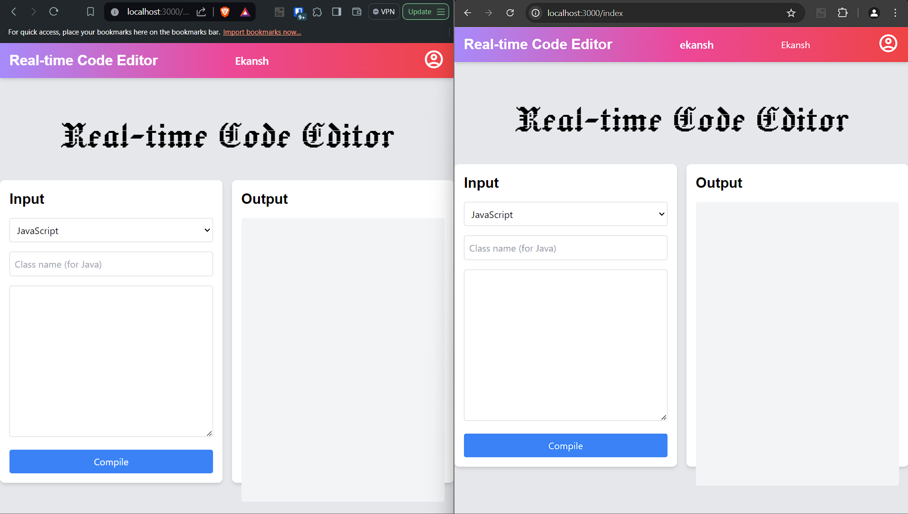

# Real-time Online Code Editor



This is a real-time online code editor that allows multiple users to write, share and compile code in various languages simultaneously. It's a great tool for remote pair programming, code reviews, teaching, and more.

## Table of Contents

- [Features](#features)
- [Technologies Used](#technologies-used)
- [Getting Started](#getting-started)
- [Contributing](#contributing)
- [License](#license)

## Features

- Real-time code sharing: See the code that other users are writing in real-time.
- Multi-language support: Write and compile code in JavaScript, Python, Java, C, C++, and Bash.
- User-friendly interface: A clean and intuitive interface that's easy to use.

## Technologies Used

- [Node.js](https://nodejs.org/)
- [Express](https://expressjs.com/)
- [Socket.IO](https://socket.io/)
- [JDoodle API](https://www.jdoodle.com/)

## Getting Started

To get a local copy up and running, follow these steps:

1. Clone this repository: `git clone https://github.com/regression1607/online-code-editor.git`
2. Navigate into the project directory: `cd online-code-editor`
3. Install the dependencies: `npm install`
4. Create a `.env` file in the root of your project and add your JDoodle client ID and client secret:

    ```env
    JD_CLIENT_ID=your_client_id
    JD_CLIENT_SECRET=your_client_secret
    ```

5. Start the server: `npm start`

Now, you can visit `http://localhost:3000` in your browser to use the application.

## Contributing

Contributions are welcome! If you have any ideas for improvements, feel free to open an issue to discuss it or submit a pull request.

## License

This project is licensed under the MIT License. See the [LICENSE](LICENSE) file for details.
